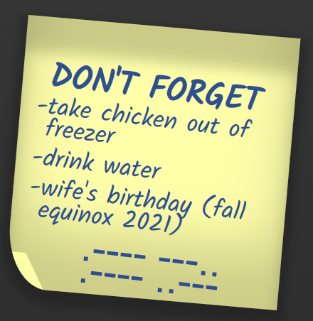

## Week 1
In week 1 van CSS To The Rescue is mijn plan om onderzoek te doen naar mogelijkheden, tools, schetsen etc. Omdat we voor dit project veel nieuwe / experimentele selectors en technieken mogen gebruiken, wil ik goed onderzoek doen naar mijn mogelijkheden. In dit document zullen zich lijstjes begeven met ideeën die wél of juist niet mogelijk zijn met CSS.

Tijdens week 1 van dit project ben ik veel bezig geweest met experimenteren en schetsen. Eerste heb ik onderzoek gedaan naar de `:has()` selector. Deze selector zorgt ervoor dat mijn hele project mogelijk is dus is het belangrijk dat er een browser is waarin deze goed werkt.

Naast het onderzoek naar css selectors heb ik er ook voor gekozen om het experimentele css nesting te gebruiken. Css nesting is momenteel alleen beschikbaar in de development versie van Google Chrome. Css nesting laat je code schijven met de volgende syntax:
```css
.container {
	background: black;
  & .child {
	font-size: 2em;
  }
}
```
Uiteindelijk wordt dit door de browser vertaald als:
```css
.container {
	background: black;
}
.container .child {
	font-size: 2em;
}
```
Het nesten van elementen kan nog veel dieper en geavanceerder dan dit door bijvoorbeeld meerdere items te nesten of pseudo selectors te gebruiken. Door te veel of te diep te nesten kan je wel snel het overzicht kwijtraken.

### Schetsen
Tijdens het schetsen van mijn paneel, heb ik ervoor gekozen nog niet al te veel te denken over de uiteindelijke layout. Omdat het paneel modulair is, kan ik altijd nog bepaald modules omwisselen / eruit halen. Voor nu wil ik zoveel mogelijk modules maken en later kiezen welke ik houd en waar ik deze plaats. Hieronder volgen de huidige schetsen.


## Week 2
Het plan voor week 2 is om meer modules te bouwen voor het bedieningspaneel. In week 1 heb ik mijn ideeën en structuur opgezet zodat ik me vanaf nu voornamelijk kan focussen op het bouwen van het paneel.

### Modules
In week 2 heb ik een module met radio buttons en een deel van een range slider module gebouwd. Het radio button paneel bestaat uit twee rijen met buttons die in een bepaald sequence moeten staan. De module met range sliders leest door middle van een stukje Javascript de waarde van de slider uit en zet met CSS in een `::before` element. Hiervoor wordt gebruik gemaakt van de `attr()` functie uit CSS.

## Week 3
In week 3 ben ik de meeste tijd bezig geweest met het plaatsen van alle modules en wat finishing touches aan de modules aan te brengen. Voor de plaatsing van de modules heb ik ervoor gekozen om grid te gebruiken. Eerder was ik van plan dit met flexbox te doen omdat flexbox wat dynamischer is dan grid. Uiteindelijk heb ik toch gekozen voor grid omdat ik het overzichtelijker vond om de modules te plaatsen. Hierdoor is het paneel minder responsive maar dit leek me ook een beetje veel om erbij te doen.

### Hints
Deze week heb ik ook de hints toegevoegd om de puzzel mee op te lossen. Ik heb eigenlijk geen idee hoe moeilijk de puzzel is omdat alleen ik hem nog heb gespeeld. De hints staan op papiertjes die op het paneel verstrooid liggen. Met meer tijd had ik nog wat creatieve manieren van hints overbrengen kunnen implementeren. Hieronder 1 van de 2 hint papiertjes.
<p align="center">
	
</p>


### Einde
Het eindresultaat wanneer je de puzzel op hebt gelost is niet helemaal wat ik eerst had bedacht. Uiteindelijk had ik niet echt meer veel tijd om het helemaal te maken zoals ik wilde. Als je m wil zien moet je de puzzel oplossen :).

Hieronder nog een klein lijstje met dingen waar ik tegenaan ben gelopen tijdens het maken van dit project.
## Dingen die niet (redelijk) kunnen
- Circular slider dmv html range input
- Knoppen die door kleuren cyclen (kan wel met 2 kleuren dmv checkbox)
- Knoppen in een bepaalde volgorde forceren
- attr() gebruiken om een css waarde te veranderen (behalve `content`)
- `:empty` selector werkt niet op `input` (workaround is `:placeholder-shown`)